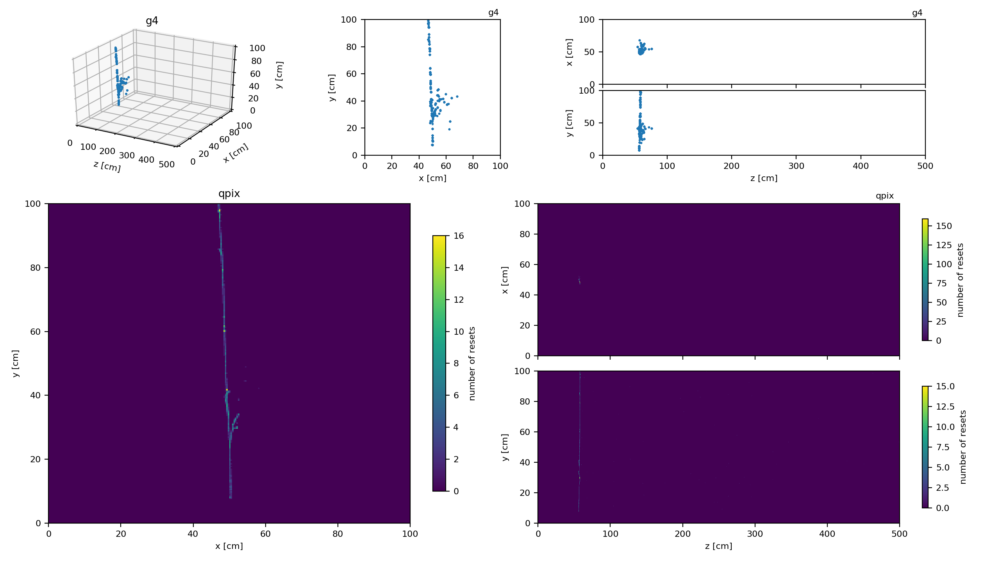
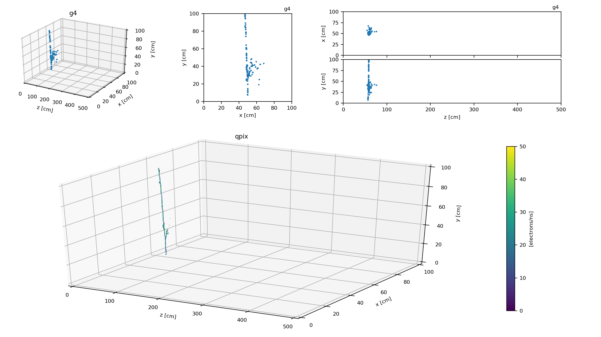

Examples
========

This directory contains example code. A simple reader example that reads from an output ROOT file produced from `Q_PIX_RTD <https://github.com/Q-Pix/Q_PIX_RTD>`__ can be run with the following command

.. code-block:: bash

    python read_root.py /path/to/root/file

Event display example
---------------------

The event display example that displays events of an output ROOT file produced from `Q_PIX_RTD <https://github.com/Q-Pix/Q_PIX_RTD>`__ can be run with the following command

.. code-block:: bash

    python qpix_ed.py /path/to/root/file

The event display example can be started in 3D mode by adding ``--3d`` to the command

.. code-block:: bash

    python qpix_ed.py /path/to/root/file --3d

and can be toggled while it is running.

MC muon event in 2D mode
~~~~~~~~~~~~~~~~~~~~~~~~

MC muon event in 3D mode
~~~~~~~~~~~~~~~~~~~~~~~~

MARLEY event in 2D mode
~~~~~~~~~~~~~~~~~~~~~~~

MARLEY event in 3D mode
~~~~~~~~~~~~~~~~~~~~~~~

